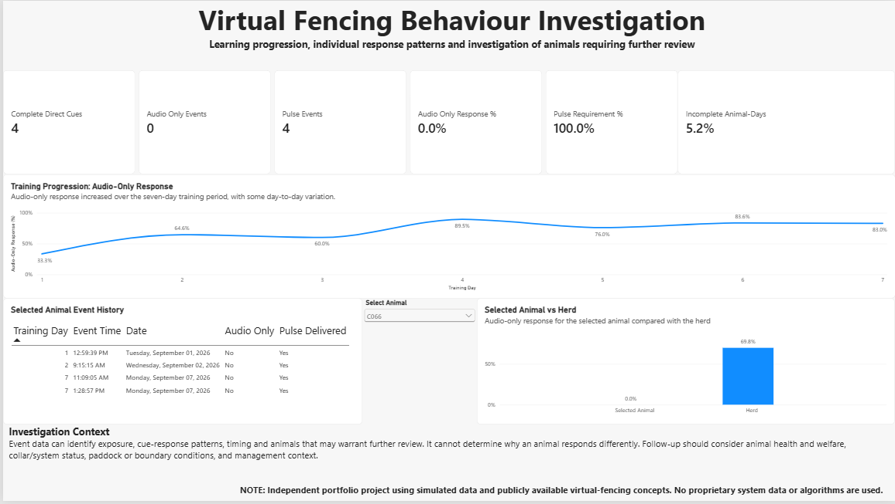

# Virtual Fencing Behaviour Investigation

**Data-driven investigation of learning progression and individual response patterns in a simulated pasture-based cattle system.**

> **Portfolio disclosure:** This is an independent portfolio project using simulated data and publicly available virtual-fencing concepts. It does not use or attempt to reproduce Halter proprietary data, algorithms or decision rules.

## Project overview

Virtual-fencing systems generate animal-level interaction data that can potentially be used for more than confirming whether a boundary was respected. This project explores how those data could support investigation of learning progression, individual response patterns and animals that may warrant further review.

The central question was:

**Can virtual-fencing interaction data be used to identify learning progression and animals whose response patterns warrant further investigation?**

The project combines simulated event-level data, R analysis and an interactive Power BI dashboard.

## Dashboard



The dashboard provides:

- herd-level learning progression across seven training days
- complete direct cue, audio-only and pulse metrics
- individual animal selection
- selected-animal event history
- selected animal versus herd comparison
- data-completeness monitoring
- investigation context to prevent over-interpretation of event data

## Research questions

1. Does herd-level response to audio cues improve across training?
2. How much individual variation exists in cue-response patterns?
3. Can event data identify animals whose response patterns differ enough to warrant investigation?
4. What can collar-event data explain, and when is additional animal, environmental or system information needed?

## Data

The simulated dataset represents:

- **72 cattle**
- **6 groups**
- **7 training days**
- **504 possible animal-days**
- **678 observed event records**
- **26 incomplete animal-days (5.16%)**

Three analyst-facing datasets are provided in [`data/`](data/):

- `animals.csv`
- `vf_events.csv`
- `daily_summary.csv`

The analysis uses only these analyst-facing datasets. Hidden simulation parameters are not used to generate the reported analytical findings or investigation categories.

## Analytical approach

The primary learning metric is **audio-only response proportion**:

**Audio-only responses / complete direct cue events**

This measures the proportion of complete direct cue interactions in which an audio cue occurred without a subsequent pulse.

Animal-level response percentages are interpreted alongside exposure because a percentage based on only a few interactions provides weaker evidence than one based on repeated exposure.

The analysis also examines data completeness and uses transparent operational triage rules to distinguish animals with patterns worth reviewing from animals with insufficient evidence.

## Key findings

### 1. Herd-level response changed across training

Audio-only response increased from **33.3% on Day 1** to **83.0% on Day 7**, although the progression was not completely linear.

Across the full seven-day period:

- **285** complete direct cue events
- **199** audio-only responses
- **86** pulse events
- **69.8%** overall audio-only response
- **30.2%** overall pulse requirement

The combined audio-only response increased from **50.6% across Days 1–2** to **83.3% across Days 6–7**.

A simple logistic regression produced an estimated odds ratio of approximately **1.42 per training day (p < 0.001)**. Because the dataset is simulated, this is treated as a descriptive analytical result rather than a biological effect estimate.

### 2. Individual exposure varied substantially

Animals did not receive equal numbers of complete direct cues.

This matters because low response percentages based on sparse exposure should not automatically be interpreted as evidence of poor learning or animal-level problems.

Exposure was therefore considered alongside response proportion throughout the individual analysis.

### 3. Sparse exposure limited statistical outlier detection

A statistical outlier approach was considered, but the available animal-level exposure was too sparse to confidently classify individual animals as statistical outliers.

Rather than forcing an outlier result, the project uses transparent operational triage:

| Category | Rule |
|---|---|
| **Limited evidence** | Fewer than 3 complete direct cues |
| **Monitor** | Exactly 3 complete direct cues and audio-only response at or below 33.3% |
| **Priority review** | At least 4 complete direct cues and audio-only response at or below 50% |
| **No flag** | All other cases |

This produced:

- **3 Priority review**
- **5 Monitor**
- **34 Limited evidence**
- **30 No flag**

These are analyst-defined portfolio rules, not biological, welfare or proprietary system thresholds.

### 4. Event data can identify a signal, not diagnose the cause

For example, animal **C066** recorded:

- 4 complete direct cues
- 0 audio-only responses
- 4 pulse events
- interactions on training Days 1, 2 and 7

This pattern makes the animal suitable for further review under the portfolio triage rule, but the event data cannot establish why the pattern occurred.

A real investigation would require additional context such as:

- animal health and welfare
- collar or system status
- connectivity or diagnostics
- paddock and boundary conditions
- feed availability and motivation
- management activity
- potentially weather and social context

## Operational interpretation

The project demonstrates a simple decision-support principle:

**Use event data to prioritise investigation, not to make a diagnosis from a single metric.**

In practice, this means:

- monitor herd learning using response metrics together with exposure
- avoid ranking low-exposure animals solely by percentages
- distinguish insufficient evidence from potentially unusual response patterns
- monitor missing data separately from animal response
- combine event-level alerts with animal, system and farm-management context before deciding what action is required

## Data quality

The analysis explicitly retains incomplete records rather than silently treating them as successful or unsuccessful responses.

Validation checks identified:

- **0 duplicate event IDs**
- **0 pulse events without an audio cue**
- **0 invalid cue records among social-response events**
- **26 incomplete animal-days (5.16%)**

## Tools used

- **R** for reproducible analysis, validation and investigation logic
- **Power BI** for interactive dashboard development and animal-level investigation
- **Excel** for exploratory checking and validation during development
- **GitHub** for project structure, documentation and reproducibility

## Evidence base

The analytical concept was informed by peer-reviewed virtual-fencing research and publicly available industry information.

### Peer-reviewed research

1. **Wilms, L., Komainda, M., Hamidi, D., Riesch, F., Horn, J. & Isselstein, J. (2024).** *How do grazing beef and dairy cattle respond to virtual fences? A review.* Journal of Animal Science, 102, skae108. https://doi.org/10.1093/jas/skae108

2. **Colusso, P. I., Clark, C. E. F. & Lomax, S. (2020).** *Should Dairy Cattle Be Trained to a Virtual Fence System as Individuals or in Groups?* Animals, 10(10), 1767. https://doi.org/10.3390/ani10101767

3. **Keshavarzi, H., Lee, C., Lea, J. M. & Campbell, D. L. M. (2020).** *Virtual Fence Responses Are Socially Facilitated in Beef Cattle.* Frontiers in Veterinary Science, 7, 543158. https://doi.org/10.3389/fvets.2020.543158

4. **Campbell, D. L. M., Lea, J. M., Keshavarzi, H. & Lee, C. (2019).** *Virtual Fencing Is Comparable to Electric Tape Fencing for Cattle Behavior and Welfare.* Frontiers in Veterinary Science, 6, 445. https://doi.org/10.3389/fvets.2019.00445

### Additional public resources

- Halter, *Virtual Fencing 101: How it works, and why it's a game-changer for farmers*
- Halter, *Animal Welfare Charter: System Overview*
- CSIRO Data Access Portal, *Herding of sheep and cattle using virtual fencing technology*, Campbell et al. (2021), DOI: 10.25919/tsfj-2804

The peer-reviewed studies largely concern research systems such as eShepherd/Agersens. They are used to inform general virtual-fencing concepts and analytical questions, not as evidence of Halter's proprietary system design or performance.

## Limitations

This is a portfolio analysis using simulated data. It cannot establish real-world biological, welfare or commercial outcomes.

Individual exposure is sparse for many animals, limiting confidence in animal-level comparisons. Event records can describe what happened but cannot independently establish why it happened.

The investigation categories are transparent analyst-defined rules created for this project. They are not validated intervention thresholds.

Public information about commercial virtual-fencing systems is also necessarily incomplete. No proprietary algorithms, thresholds or datasets are assumed or reproduced.

## Reproducibility

The reproducible R analysis is available in [`analysis/`](analysis/).

From the repository root:

```bash
Rscript analysis/virtual_fencing_analysis.R
```

The script validates the input datasets and reproduces the main herd-level metrics, individual summaries and investigation categories.

Generated outputs are stored in [`analysis/outputs/`](analysis/outputs/).

Detailed methodology, assumptions and limitations are documented in [`docs/README.md`](docs/README.md).

## Repository structure

```text
virtual-fencing-behaviour-analysis/
├── analysis/
│   ├── outputs/
│   ├── README.md
│   └── virtual_fencing_analysis.R
├── dashboard/
│   ├── README.md
│   └── virtual_fencing_dashboard.png
├── data/
│   ├── README.md
│   ├── animals.csv
│   ├── daily_summary.csv
│   └── vf_events.csv
├── docs/
│   └── README.md
└── README.md
```

## Project focus

This project is intended to demonstrate the practical combination of **animal science, farm-system understanding, data analysis and decision support**.

The emphasis is not simply on identifying an unusual number. It is on determining whether the available evidence is sufficient, identifying what the data can and cannot explain, and translating the result into a sensible next investigation step.
